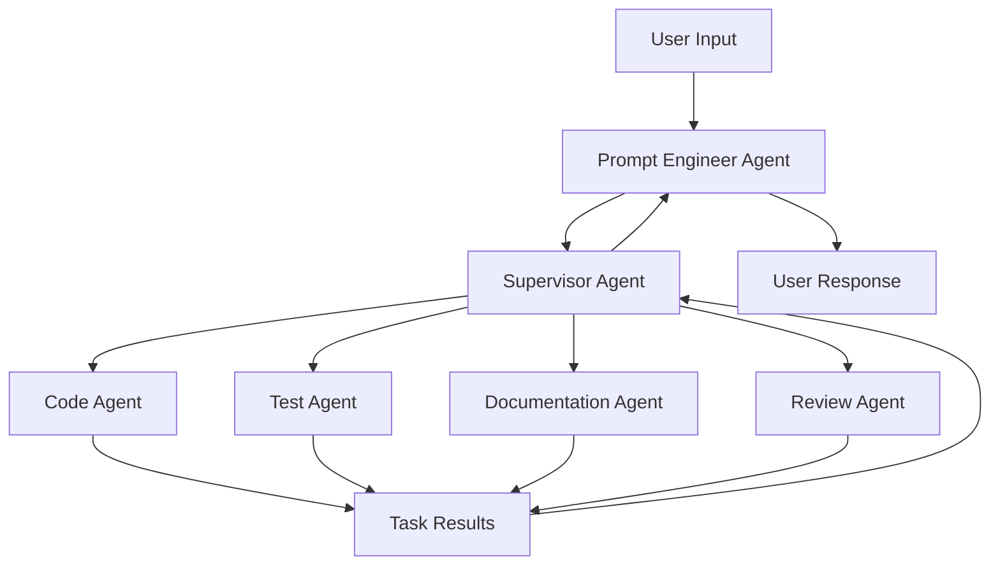

# Agenta Architecture Documentation

## Overview
Agenta is a VS Code extension that uses a system of specialized AI agents to assist with software development tasks. The system leverages CrewAI to create a hierarchical team of agents that work together to understand, implement, test, document, and review code changes.

## Agent Hierarchy



### Agent Roles

1. **Prompt Engineer Agent**
   - First point of contact for user inputs
   - Analyzes and structures user requests
   - Identifies technical requirements and constraints
   - Determines which agents need to be involved
   - Provides context and clarification for other agents

2. **Supervisor Agent**
   - Coordinates between specialized agents
   - Breaks down tasks into subtasks
   - Manages task delegation and sequencing
   - Ensures coherent integration of results

3. **Code Agent**
   - Implements and modifies code
   - Follows best practices and project standards
   - Handles both new implementations and code changes

4. **Test Agent**
   - Creates comprehensive test suites
   - Implements unit and integration tests
   - Verifies code functionality and reliability

5. **Documentation Agent**
   - Creates and maintains code documentation
   - Generates usage examples and API docs
   - Ensures documentation clarity and completeness

6. **Review Agent**
   - Reviews code for quality and best practices
   - Identifies potential issues and improvements
   - Ensures code meets project standards

## Request Flow

1. **User Input Processing**
   ```
   User Request -> Prompt Analysis -> Enhanced Task Description
   ```
   - Prompt Engineer Agent analyzes the request
   - Extracts technical requirements and constraints
   - Identifies required agents and dependencies
   - Creates structured task description

2. **Task Coordination**
   ```
   Enhanced Task -> Task Breakdown -> Agent Assignment -> Execution
   ```
   - Supervisor Agent receives enhanced task
   - Breaks down into subtasks
   - Assigns to appropriate specialized agents
   - Monitors execution and collects results

3. **Task Execution**
   ```
   Agent Tasks -> Implementation -> Validation -> Integration
   ```
   - Specialized agents execute their tasks
   - Results are validated and reviewed
   - Integrated into coherent output

4. **Result Aggregation**
   ```
   Individual Results -> Integration -> Final Review -> User Response
   ```
   - Results collected from all agents
   - Integrated into cohesive response
   - Enhanced with context and explanations
   - Delivered back to user

## Configuration

The system uses YAML-based configuration for:
- Agent definitions and roles
- Task templates and expectations
- Process flows and coordination rules

### Example Configurations

1. **Agent Configuration (agents.yaml)**
```yaml
prompt_agent:
  role: Prompt Engineer
  goal: Optimize and structure user inputs
  backstory: Expert in analyzing and structuring requests

supervisor_agent:
  role: Development Supervisor
  goal: Coordinate development tasks
  backstory: Experienced in project management
```

2. **Task Configuration (tasks.yaml)**
```yaml
analyze_prompt:
  description: Analyze and enhance user input
  expected_output: Structured technical requirements
  agent: prompt_agent

implement_code:
  description: Implement or modify code
  expected_output: Code meeting requirements
  agent: code_agent
```

## Memory and State Management

- Each agent maintains its own memory of interactions
- Shared context through CrewAI's memory system
- Task history and results are preserved
- Enables continuity across related tasks

## Development Workflow

1. **Initial Request**
   - User submits task through VS Code
   - Prompt Engineer Agent analyzes and structures request
   - Creates enhanced task description with context

2. **Task Planning**
   - Supervisor Agent receives structured task
   - Determines required agents and sequence
   - Creates execution plan

3. **Implementation**
   - Code Agent implements changes
   - Test Agent creates/updates tests
   - Documentation Agent updates docs
   - Review Agent validates changes

4. **Integration**
   - Results combined and validated
   - Final review and quality check
   - Response prepared with context

5. **Delivery**
   - Results presented to user
   - Context and explanations included
   - Next steps or suggestions provided

## Error Handling and Recovery

- Each agent implements retry mechanisms
- Graceful degradation when subtasks fail
- Clear error reporting and suggestions
- Automatic task resumption where possible

## Extensibility

The system can be extended through:
- New specialized agents
- Additional tools and capabilities
- Custom task types and workflows
- Enhanced analysis patterns

## Future Enhancements

- Advanced context analysis
- Learning from past interactions
- Improved task optimization
- Enhanced collaboration patterns
